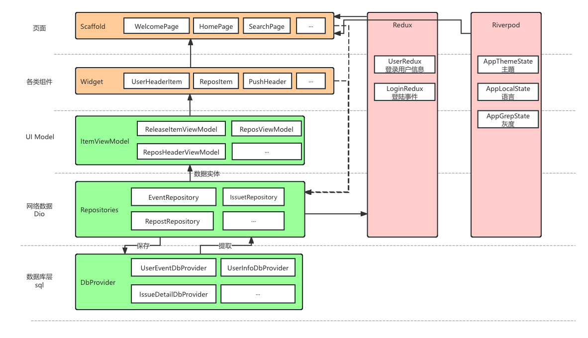
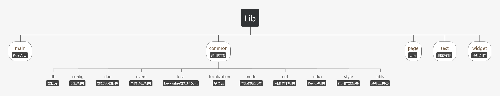
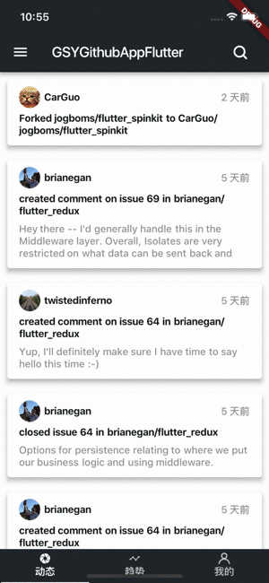
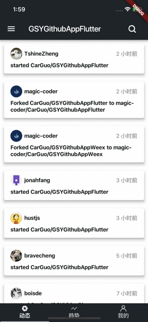

[](https://github.com/CarGuo/gsy_github_app_flutter/actions)
[](https://github.com/CarGuo/GSYGithubAppFlutter/stargazers)
[](https://github.com/CarGuo/GSYGithubAppFlutter/network)
[](https://github.com/CarGuo/GSYGithubAppFlutter/issues)
[](https://github.com/CarGuo/GSYGithubAppFlutter/blob/master/LICENSE)

### [English Readme](https://github.com/CarGuo/GSYGithubAppFlutter/blob/master/README_EN.md)


## 一款跨平台的开源Github客户端App，提供更丰富的功能，更好体验，旨在更好的日常管理和维护个人Github，提供更好更方便的驾车体验～～Σ(￣。￣ﾉ)ﾉ。项目涉及各种常用控件、网络、数据库、设计模式、主题切换、多语言、Redux等。在开发学习过程中，提供丰富的同款对比：


* ### 简单 Flutter 独立学习项目 ( https://github.com/CarGuo/gsy_flutter_demo )
* ### 同款Weex版 （ https://github.com/CarGuo/GSYGithubAppWeex ）
* ### 同款ReactNative版 （ https://github.com/CarGuo/GSYGithubApp ）
* ### 同款Android Kotlin版本（ https://github.com/CarGuo/GSYGithubAppKotlin ）


## 相关文章

- ## [Flutter系列文章专栏](https://juejin.cn/column/6960546078202527774)

----
- ## [Flutter 独立简单学习演示项目](https://github.com/CarGuo/gsy_flutter_demo)
- ## [Flutter 完整开发实战详解 Gitbook 预览下载](https://github.com/CarGuo/gsy_flutter_book)
- ## [所有运行问题请点击这里](https://github.com/CarGuo/gsy_github_app_flutter/issues/13)


* ### GSY新书：[《Flutter开发实战详解》](https://item.jd.com/12883054.html)上架啦：[京东](https://item.jd.com/12883054.html) / [当当](http://product.dangdang.com/28558519.html) / 电子版[京东读书](https://e.jd.com/30624414.html)和[Kindle](https://www.amazon.cn/dp/B08BHQ4TKK/ref=sr_1_5?__mk_zh_CN=亚马逊网站&keywords=flutter&qid=1593498531&s=digital-text&sr=1-5)

[](https://item.jd.com/12883054.html)


| 公众号   | 掘金     |  知乎    |  CSDN   |   简书   
|---------|---------|--------- |---------|---------|
| GSYTech  |  [点我](https://juejin.im/user/582aca2ba22b9d006b59ae68/posts)    |   [点我](https://www.zhihu.com/people/carguo)       |   [点我](https://blog.csdn.net/ZuoYueLiang)  |   [点我](https://www.jianshu.com/u/6e613846e1ea)  

- ### [如果克隆太慢或者图片看不到，可尝试从码云地址下载](https://gitee.com/CarGuo/GSYGithubAppFlutter)

```!
基于Flutter开发，适配 Android 与 iOS。

项目的目的是为方便个人日常维护和查阅Github，更好的沉浸于码友之间的互基，Github就是你的家。

项目同时适合Flutter的练手学习，覆盖了各种框架的使用，与原生的交互等。

随着项目的使用情况和反馈，将时不时根据更新并完善用户体验与功能优化吗，欢迎提出问题。
```


-----

## 须知

> **因为是偏学习项目，所以项目里会有各式各样的模式、库、UI等，请不要介意**
> 
> 1、 TrendPage ： 目前采用纯 bloc 的 rxdart(stream) + streamBuilder 模式效果
>
> 2、 Scoped Model：目前在 RepositoryDetailPage 出使用
>
> 3、 Redux：目前在 MyPage ，UserInfo、Theme、Localization 等上面使用。
>
> 4、 LoginPage：另类的 BLoC 模式。
> 
> 5、 ReposDao.getRepositoryDetailDao 使用 graphQL
> 
> **列表显示有多个，其中：**
> 
> 1、**gsy_pull_load_widget.dart.dart**
> `common_list_page.dart 等使用，搭配 gsy_list_state.dart 使用`
>
> 2、**gsy_pull_new_load_widget.dart.dart**
> `dynamic_page.dart 等使用，搭配 gsy_bloc_list_state.dart 使用`
> `有 iOS 和 Android 两种风格下拉风格支持`
> 
> 3、**gsy_nested_pull_load_widget.dart**
> `trend_page.dart 等使用，配置sliver 效果`


## 编译运行流程

1、配置好Flutter开发环境(目前Flutter SDK 版本 **3.16**)，可参阅 [【搭建环境】](https://flutterchina.club)。

2、clone代码，执行`Packages get`安装第三方包。(因为某些不可抗力原因，国内可能需要设置代理: [代理环境变量](https://flutterchina.club/setup-windows/))

>### 3、重点：你需要自己在lib/common/config/目录下 创建一个`ignoreConfig.dart`文件，然后输入你申请的Github client_id 和 client_secret。

     class NetConfig {
       static const CLIENT_ID = "xxxx";
     
       static const CLIENT_SECRET = "xxxxxxxxxxx";
     }


   [      注册 Github APP 传送门](https://github.com/settings/applications/new)，当然，前提是你现有一个github账号(～￣▽￣)～ 。
 
### 4、如果使用安全登录（授权登录），那么在上述注册 Github App 的 Authorization callback URL 一栏必须填入 `gsygithubapp://authed`

<div>


</div>

### 5、运行之前请注意下

>### 1、本地 Flutter SDK 版本 3.16 ； 2、是否执行过 `flutter pub get`；3、 网络等问题参考: [如果出现登陆失败或者请求失败 ](https://github.com/CarGuo/gsy_github_app_flutter/issues/643)


### 下载

#### Apk下载链接： [Apk下载链接](https://www.pgyer.com/guqa)


| 类型          | 二维码                                      |
| ----------- | ---------------------------------------- |
| **Apk二维码**  |  |
| **iOS暂无下载** | |


## 项目结构图






### 常见问题

* 如果包同步失败，一般都是因为没设置包代理，可以参考：[环境变量问题](https://github.com/CarGuo/GSYGithubAppFlutter/issues/13)

* [如果克隆太慢，可尝试码云地址下载](https://gitee.com/CarGuo/GSYGithubAppFlutter)

### 示例图片






### 第三方框架

>当前 Flutter SDK 版本 3.16

| 库                          | 功能             |
| -------------------------- | -------------- |
| **dio**                    | **网络框架**       |
| **shared_preferences**     | **本地数据缓存**     |
| **fluttertoast**           | **toast**      |
| **flutter_redux**          | **redux**      |
| **device_info**            | **设备信息**       |
| **connectivity**           | **网络链接**       |
| **flutter_markdown**       | **markdown解析** |
| **json_annotation**        | **json模板**     |
| **json_serializable**      | **json模板**     |
| **url_launcher**           | **启动外部浏览器**    |
| **iconfont**               | **字库图标**       |
| **share**                  | **系统分享**       |
| **flutter_spinkit**        | **加载框样式**      |
| **get_version**            | **版本信息**       |
| **flutter_webview_plugin** | **全屏的webview** |
| **sqflite**                | **数据库**        |
| **flutter_statusbar**      | **状态栏**        |
| **flutter_svg**            | **svg**        |
| **photo_view**             | **图片预览**       |
| **flutter_slidable**       | **侧滑**         |
| **flutter_cache_manager**  | **缓存管理**       |
| **path_provider**          | **本地路径**       |
| **permission_handler**     | **权限**         |
| **scope_model**            | **状态管理和共享**    |
| **lottie**                 | **svg动画**    |
| **flare**                  | **路径动画**    |

## Star History Chart

[](https://star-history.com/#CarGuo/gsy_github_app_flutter&Date)


### LICENSE
```
CarGuo/GSYGithubAppFlutter is licensed under the
Apache License 2.0

A permissive license whose main conditions require preservation of copyright and license notices. 
Contributors provide an express grant of patent rights. 
Licensed works, modifications, and larger works may be distributed under different terms and without source code.
```


​    
