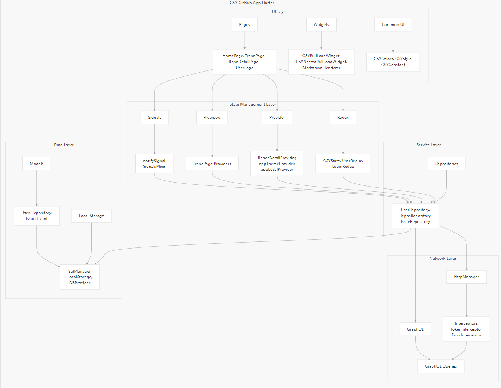
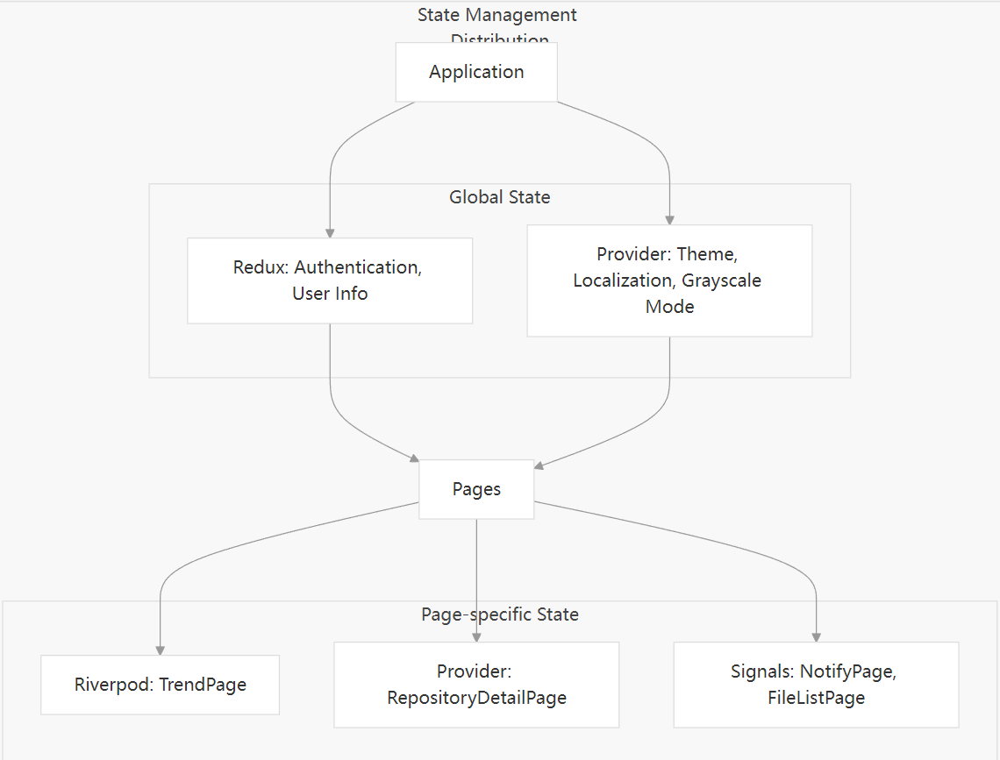
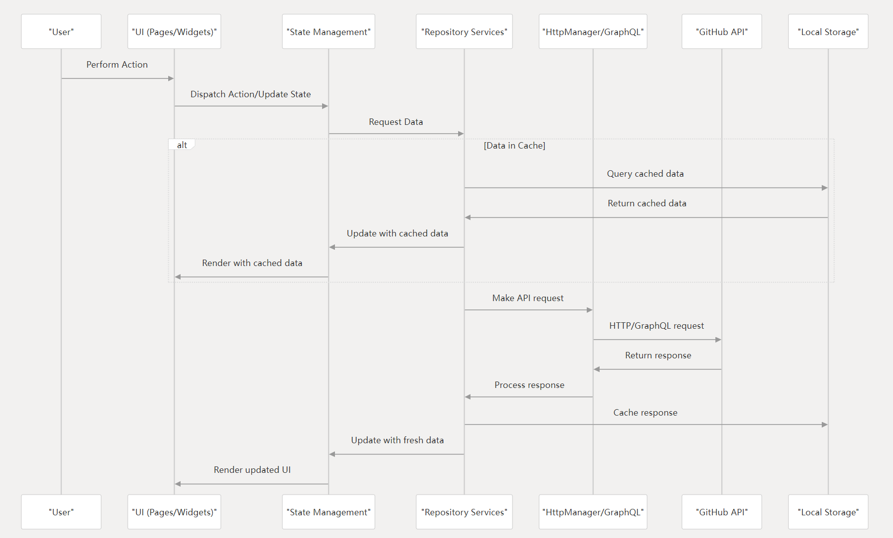
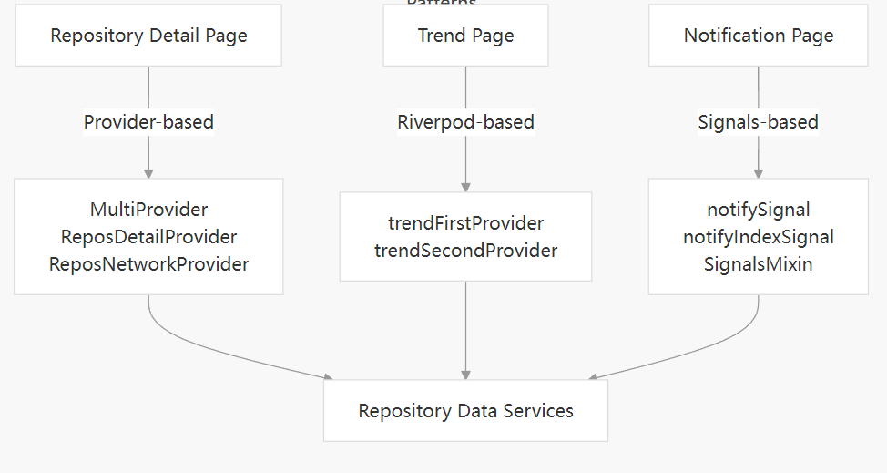

[](https://github.com/CarGuo/gsy_github_app_flutter/actions)
[](https://github.com/CarGuo/GSYGithubAppFlutter/stargazers)
[](https://github.com/CarGuo/GSYGithubAppFlutter/network)
[](https://github.com/CarGuo/GSYGithubAppFlutter/issues)
[](https://github.com/CarGuo/GSYGithubAppFlutter/blob/master/LICENSE)
[](https://gitcode.com/ZuoYueLiang/gsy_github_app_flutter)


### [English Readme](https://github.com/CarGuo/GSYGithubAppFlutter/blob/master/README_EN.md)


## 一款跨平台的开源Github客户端App，提供更丰富的功能，更好体验，旨在更好的日常管理和维护个人Github，提供更好更方便的驾车体验～～Σ(￣。￣ﾉ)ﾉ。项目涉及各种常用控件、网络、数据库、设计模式、主题切换、多语言、状态管理（Redux、Riverpod、Provider）等。在开发学习过程中，提供丰富的同款对比：


* ### 同款Weex版 （ https://github.com/CarGuo/GSYGithubAppWeex ）
* ### 同款ReactNative版 （ https://github.com/CarGuo/GSYGithubApp ）
* ### 同款Android Kotlin View版本（ https://github.com/CarGuo/GSYGithubAppKotlin ）
* ### 同款Android Compose版本（ https://github.com/CarGuo/GSYGithubAppKotlinCompose ）

* ### 简单 Flutter 独立学习项目 ( https://github.com/CarGuo/gsy_flutter_demo )


## 相关文章

| 公众号   | 掘金     |  知乎    |  CSDN   |   简书   
|---------|---------|--------- |---------|---------|
| GSYTech  |  [点我](https://juejin.cn/user/582aca2ba22b9d006b59ae68/posts)    |   [点我](https://www.zhihu.com/people/carguo)       |   [点我](https://blog.csdn.net/ZuoYueLiang)  |   [点我](https://www.jianshu.com/u/6e613846e1ea)  

- ### [Flutter系列文章专栏](https://juejin.cn/column/6960546078202527774)

----
- ### [Flutter 独立简单学习演示项目](https://github.com/CarGuo/gsy_flutter_demo)
- ### [Flutter 完整开发实战详解 Gitbook 预览下载](https://github.com/CarGuo/gsy_flutter_book)
- ### [所有运行问题请点击这里](https://github.com/CarGuo/gsy_github_app_flutter/issues/13)

* ### GSY老书：[《Flutter开发实战详解》](https://item.jd.com/12883054.html)上架啦：[京东](https://item.jd.com/12883054.html) / [当当](http://product.dangdang.com/28558519.html) / 电子版[京东读书](https://e.jd.com/30624414.html)和[Kindle](https://www.amazon.cn/dp/B08BHQ4TKK/ref=sr_1_5?__mk_zh_CN=亚马逊网站&keywords=flutter&qid=1593498531&s=digital-text&sr=1-5)

- ### [如果克隆太慢或者图片看不到，可尝试从码云地址下载](https://gitee.com/CarGuo/GSYGithubAppFlutter)


-----

## 须知

> **因为是偏学习展示项目，所以项目里会有各式各样的模式、库、UI等，请不要介意**
> 
> 0、 全局状态管理目前有多种模式，包括 Provider、Redux、Riverpod 等
> 
> 1、 TrendPage ： 目前采用纯  riverpod  状态管理，演示
>
> 2、 Provider：目前在 RepositoryDetailPage 出使用
>
> 3、 Redux：目前展示了全局登陆和用户信息等上面使用。
> 
> 4、 riverpod：目前用于管理全局灰度，多语言。
>
> 5、 Repos 等请求展示了 graphQL
> 
> 6、 Redux：目前展示了全局登陆和用户信息等上面使用。
> 
> 7、 Signals：目前用于 NotifyPage、RepositoryDetailFileListPage 页面内状态管理
> 
> **列表显示有多个，其中：**
> 
> 1、**gsy_pull_load_widget.dart.dart**
> `common_list_page.dart 等使用，搭配 gsy_list_state.dart 使用`
>
> 2、**gsy_pull_new_load_widget.dart.dart**
> `dynamic_page.dart 等使用，搭配 gsy_bloc_list_state.dart 使用`
> `有 iOS 和 Android 两种风格下拉风格支持`
> 
> 3、**gsy_nested_pull_load_widget.dart**
> `trend_page.dart 等使用，配置sliver 效果`


## 编译运行流程

1、配置好Flutter开发环境(目前Flutter SDK 版本 **3.35**)，可参阅 [【搭建环境】](https://flutterchina.club)。

2、clone代码，执行`Packages get`安装第三方包。(因为某些不可抗力原因，国内可能需要设置代理: [代理环境变量](https://flutterchina.club/setup-windows/))

>### 3、重点：你需要自己在lib/common/config/目录下 创建一个`ignoreConfig.dart`文件，然后输入你申请的Github client_id 和 client_secret。

     class NetConfig {
       static const CLIENT_ID = "xxxx";
     
       static const CLIENT_SECRET = "xxxxxxxxxxx";
     }


   [      注册 Github APP 传送门](https://github.com/settings/applications/new)，当然，前提是你现有一个github账号(～￣▽￣)～ 。
 
### 4、如果使用安全登录（授权登录），那么在上述注册 Github App 的 Authorization callback URL 一栏必须填入 `gsygithubapp://authed`

<div>


</div>

### 5、运行之前请注意下

>### 1、本地 Flutter SDK 版本 3.35 ； 2、是否执行过 `flutter pub get`；3、 网络等问题参考: [如果出现登陆失败或者请求失败 ](https://github.com/CarGuo/gsy_github_app_flutter/issues/643)


### 下载

#### Apk下载链接： [Apk下载链接1 ](https://github.com/CarGuo/gsy_github_app_flutter/releases)
#### Apk下载链接： [Apk下载链接2 ](https://www.openapk.net/gsygithubappflutter/com.shuyu.gsygithub.gsygithubappflutter/)


| 类型          | 二维码                                      |
| ----------- | ---------------------------------------- |
| **Apk二维码**  |  |
| **iOS暂无下载** | |


## 项目结构图


### 常见问题

* 如果包同步失败，一般都是因为没设置包代理，可以参考：[环境变量问题](https://github.com/CarGuo/GSYGithubAppFlutter/issues/13)

* [如果克隆太慢，可尝试码云地址下载](https://gitee.com/CarGuo/GSYGithubAppFlutter)

### 示例图片
### 示例图片


### 框架

>当前 Flutter SDK 版本 3.35

```
用户交互 → UI层(Widget/Page) → 状态层(Redux/Provider/Riverpod) → 服务层(Repositories) 
       → 网络层(Net) → GitHub API → 数据模型(Model) → 本地存储(DB) → UI更新
```

```
┌─────────────────────────────────────────────────────────────────┐
│                         GSY GitHub App                          │
├─────────────┬───────────────┬────────────────┬─────────────────┤
│   UI Layer  │  State Layer  │  Service Layer │     Data Layer  │
├─────────────┼───────────────┼────────────────┼─────────────────┤
│             │               │                │                 │
│  ┌─────────┐│  ┌─────────┐  │  ┌─────────┐   │   ┌─────────┐   │
│  │ Pages   ││  │ Redux   │  │  │Repositories│  │   │ Models │   │
│  └─────────┘│  └─────────┘  │  └─────────┘   │   └─────────┘   │
│             │               │                │                 │
│  ┌─────────┐│  ┌─────────┐  │  ┌─────────┐   │   ┌─────────┐   │
│  │ Widgets ││  │ Provider│  │  │Network API│  │   │Database │   │
│  └─────────┘│  └─────────┘  │  └─────────┘   │   └─────────┘   │
│             │               │                │                 │
│  ┌─────────┐│  ┌─────────┐  │                │                 │
│  │Common UI││  │Riverpod │  │                │                 │
│  └─────────┘│  └─────────┘  │                │                 │
│             │               │                │                 │
│             │  ┌─────────┐  │                │                 │
│             │  │ Signals │  │                │                 │
│             │  └─────────┘  │                │                 │
│             │               │                │                 │
└─────────────┴───────────────┴────────────────┴─────────────────┘
```

```
lib/
├── main.dart              # 应用入口点
├── main_prod.dart         # 生产环境入口点
├── app.dart               # 应用配置与路由
├── common/                # 公共功能模块
│   ├── config/            # 应用配置
│   ├── event/             # 事件总线
│   ├── local/             # 本地化
│   ├── localization/      # 多语言支持
│   ├── net/               # 网络请求
│   ├── repositories/      # 数据仓库
│   ├── router/            # 路由配置
│   ├── style/             # 样式配置
│   └── utils/             # 工具类
├── db/                    # 数据库相关
│   ├── provider/          # 数据库提供者
│   ├── sql_manager.dart   # SQL管理器
│   └── sql_provider.dart  # SQL提供者
├── env/                   # 环境配置
├── model/                 # 数据模型
├── page/                  # 页面
│   ├── debug/             # 调试页面
│   ├── dynamic/           # 动态页面
│   ├── home/              # 主页
│   ├── issue/             # Issue相关页面
│   ├── login/             # 登录页面
│   ├── push/              # 推送相关页面
│   ├── release/           # 发布相关页面
│   ├── repos/             # 仓库相关页面
│   ├── search/            # 搜索页面
│   ├── trend/             # 趋势页面
│   └── user/              # 用户相关页面
├── provider/              # Provider状态管理
├── redux/                 # Redux状态管理
│   ├── middleware/        # Redux中间件
│   ├── gsy_state.dart     # Redux状态定义
│   ├── login_redux.dart   # 登录状态管理
│   └── user_redux.dart    # 用户状态管理
├── test/                  # 测试相关
└── widget/                # 自定义组件
    ├── anima/             # 动画组件
    ├── markdown/          # Markdown渲染组件
    ├── menu/              # 菜单组件
    ├── particle/          # 粒子效果组件
    ├── pull/              # 下拉刷新组件
    └── state/             # 状态相关组件
```

riverpod 页面内状态管理：

```
┌───────────────────────────────────────────────────────────────────────────┐
│                         Page Architecture Overview                         │
└───────────────────────────────────────────────────────────────────────────┘
                                      │
                                      ▼
┌───────────────────────────────────────────────────────────────────────────┐
│                              Global State                                  │
│  ┌───────────────────┐   ┌────────────────────┐   ┌────────────────────┐  │
│  │ appThemeProvider  │   │ appLocalProvider   │   │ appGrepProvider    │  │
│  │ (Theme Data)      │   │ (Localization)     │   │ (Grayscale Mode)   │  │
│  └───────────────────┘   └────────────────────┘   └────────────────────┘  │
└───────────────────────────────────────────────────────────────────────────┘
                                      │
                     ┌────────────────┴────────────────┐
                     ▼                                 ▼
┌─────────────────────────────────┐  ┌─────────────────────────────────────┐
│     TrendPage (Riverpod)        │  │       NotifyPage (Signals)          │
├─────────────────────────────────┤  ├─────────────────────────────────────┤
│                                 │  │                                     │
│┌─────────────────────────────┐  │  │┌───────────────────────────────────┐│
││      Riverpod Providers     │  │  ││         Signals State             ││
││┌───────────────────────────┐│  │  ││┌─────────────────────────────────┐││
│││    trendFirstProvider     ││  │  │││   notifySignal (List)           │││
│││    trendSecondProvider    ││  │  │││   notifyIndexSignal (int)       │││
││└───────────────────────────┘│  │  │││   signalPage (int)              │││
│└─────────────────────────────┘  │  ││└─────────────────────────────────┘││
│                                 │  │└───────────────────────────────────┘│
│┌─────────────────────────────┐  │  │┌───────────────────────────────────┐│
││  Local State (StatefulWidget)│  │  ││     SignalsMixin Processing      ││
││  - UI Controls              │  │  ││  - createEffect() for reactions   ││
││  - Filter Parameters        │  │  ││  - Manages data loading           ││
│└─────────────────────────────┘  │  ││  - Updates UI based on signals    ││
│                                 │  │└───────────────────────────────────┘│
└─────────────────────────────────┘  └─────────────────────────────────────┘
                     │                                 │
                     └────────────────┬────────────────┘
                                      ▼
┌───────────────────────────────────────────────────────────────────────────┐
│                            Data Layer                                      │
│  ┌───────────────────────────────────────────────────────────────────────┐ │
│  │                  ReposRepository / UserRepository                     │ │
│  │  ┌────────────────────────┐       ┌─────────────────────────────────┐ │ │
│  │  │ Network Request        │───┬──▶│ Database Providers              │ │ │
│  │  │ - API calls            │   │   │ - Data caching                  │ │ │
│  │  └────────────────────────┘   │   └─────────────────────────────────┘ │ │
│  │                               │                                       │ │
│  │                               │   ┌─────────────────────────────────┐ │ │
│  │                               └──▶│ Data Models                     │ │ │
│  │                                   │ - Structure definitions         │ │ │
│  │                                   └─────────────────────────────────┘ │ │
│  └───────────────────────────────────────────────────────────────────────┘ │
└───────────────────────────────────────────────────────────────────────────┘
                                      │
                                      ▼
┌───────────────────────────────────────────────────────────────────────────┐
│                              UI Components                                 │
│  ┌────────────────────┐  ┌────────────────────┐  ┌────────────────────┐   │
│  │ View Models        │  │ List Items         │  │ Interactive UI     │   │
│  │ - Data Formatting  │  │ - Item Rendering   │  │ - User Actions     │   │
│  └────────────────────┘  └────────────────────┘  └────────────────────┘   │
└───────────────────────────────────────────────────────────────────────────┘
```

provider 页面内状态管理：

```
+-----------------------------------------------------+
|                   App User Interface                 |
+-----------------------------------------------------+
                          |
                          v
+-----------------------------------------------------+
|              RepositoryDetailPage (StatefulWidget)  |
|            with SingleTickerProviderStateMixin      |
+-----------------------------------------------------+
                          |
                          v
+-----------------------------------------------------+
|                   MultiProvider                      |
+-----------------------------------------------------+
        |                                 |
        v                                 v
+------------------+           +-----------------------+
| ReposNetWork     |<----------|  ReposDetailProvider  |
| Provider         |           |                       |
+---------+--------+           +-----------------------+
          |                                |
          |                                |
          v                                v
+-----------------------------------------------------+
|              Repository Data Services               |
| (ReposRepository, IssueRepository)                  |
+-----------------------------------------------------+
          |
          v
+-----------------------------------------------------+
|                Four Tab Pages (Consumers)           |
+-----------------------------------------------------+
    |           |           |           |
    v           v           v           v
+----------+ +----------+ +----------+ +----------+
| Info     | | Readme   | | Issues   | | Files    |
| Page     | | Page     | | Page     | | Page     |
+----------+ +----------+ +----------+ +----------+
    |           |           |           |
    |           |           |           |
    v           v           v           v
+-----------------------------------------------------+
|                GlobalKeys for Tab Access             |
| (infoListKey, readmeKey, issueListKey, fileListKey) |
+-----------------------------------------------------+

```





## Star History Chart

[](https://star-history.com/#CarGuo/gsy_github_app_flutter&Date)


### LICENSE
```
CarGuo/GSYGithubAppFlutter is licensed under the
Apache License 2.0

A permissive license whose main conditions require preservation of copyright and license notices. 
Contributors provide an express grant of patent rights. 
Licensed works, modifications, and larger works may be distributed under different terms and without source code.
```


 
